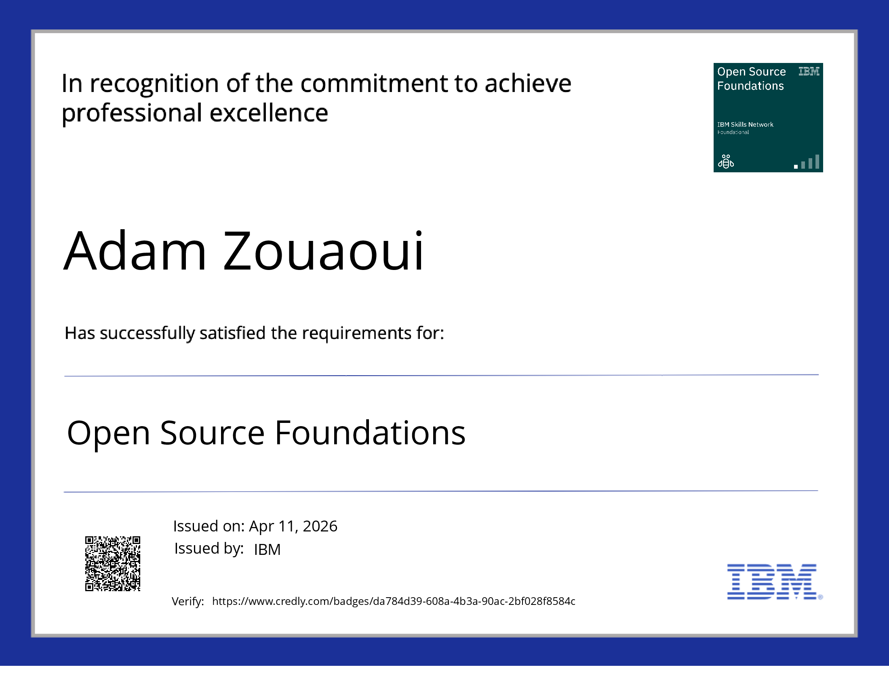
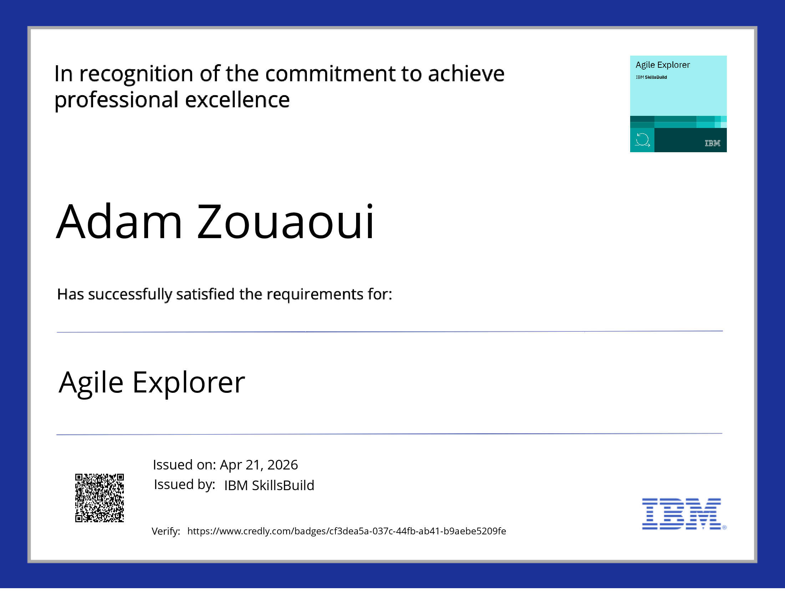

# IBM Certifications

Certifications obtenues dans le cadre du programme Holberton School France x IBM.

## Trimestre 1

**Open Source Foundations**

Certification validant les fondamentaux de l'open source : licences, contribution, gouvernance et écosystème des projets communautaires.

---

**Agile Explorer**

Certification validant les principes de la méthode agile : itérations, collaboration, livraison continue et adaptation au changement.
