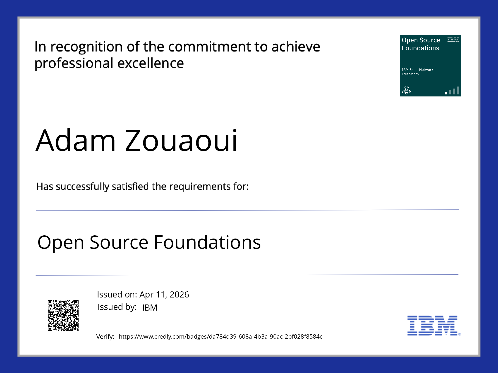
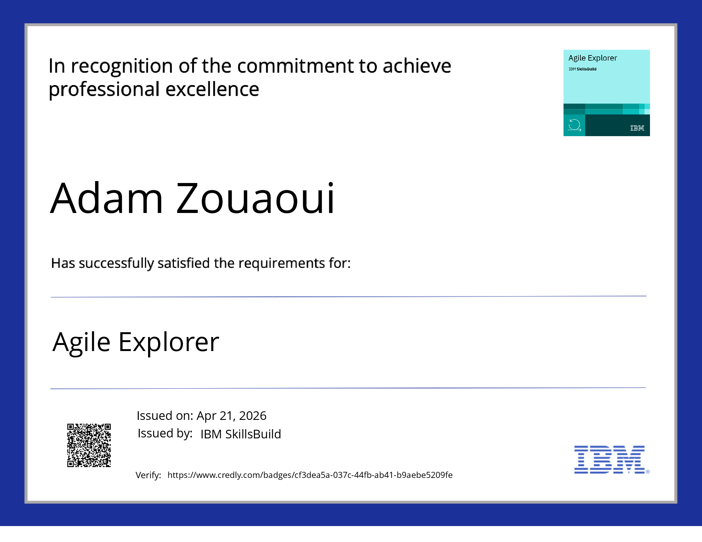
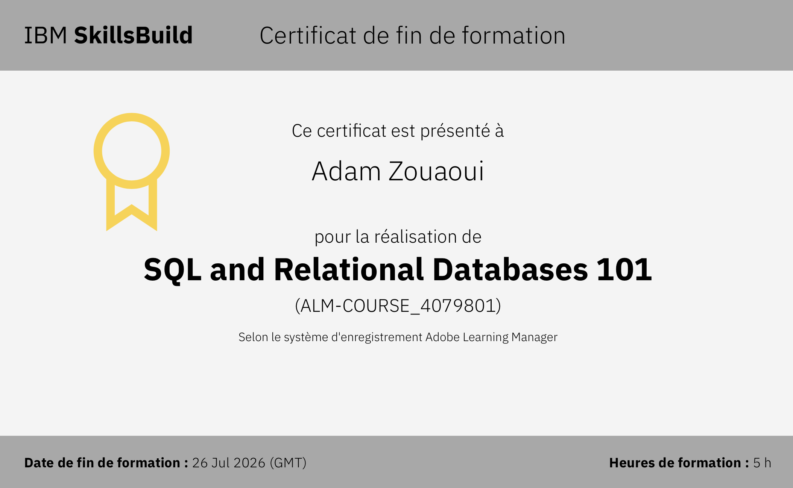
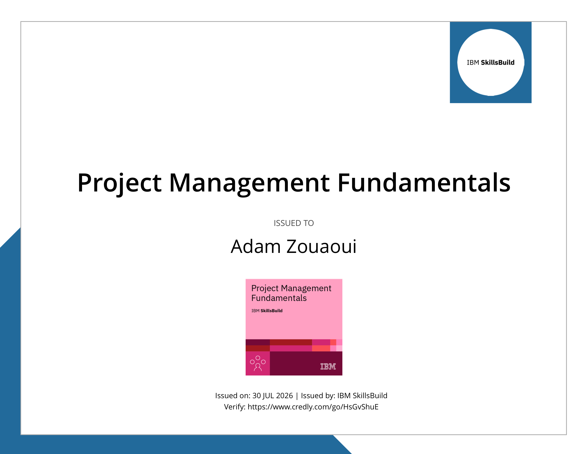

# IBM Certifications

Certifications obtenues dans le cadre du programme Holberton School France x IBM.

## Trimestre 1

**Open Source Foundations**

Certification validant les fondamentaux de l'open source : licences, contribution, gouvernance et écosystème des projets communautaires.

---

**Agile Explorer**

Certification validant les principes de la méthode agile : itérations, collaboration, livraison continue et adaptation au changement.

## Trimestre 2

**SQL and Relational Databases 101**

Certification validant les bases du SQL et des bases de données relationnelles : modèle relationnel, requêtes, jointures et manipulation des données.

---

**Project Management Fundamentals**

Certification validant les fondamentaux de la gestion de projet : cadrage, planification, gestion des ressources et suivi jusqu'à la clôture.
